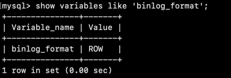
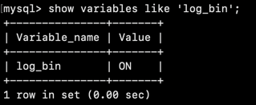
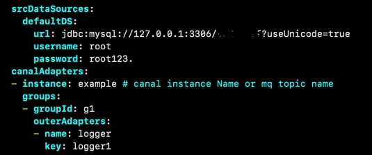
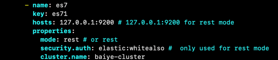
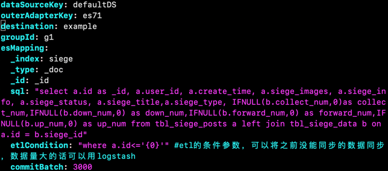

## canal 同步数据到 elasticsearch

### 版本（可以看自己使用其他版本）

| mysql版本 | canal server版本 | canal adapter 版本 | elasticsearch版本 |
| --------- | -------- | --------| -------- |
| 5.7 | v1.1.5-alpha-2 | v1.1.5-alpha-2| 7.10.2|

### mysql
* 首先要安装mysql
* 在/etc/my.conf中添加sql配置，开启主从同步
  ```
  [mysqld]
  log-bin=mysql-bin
  binlog-format=ROW
  server-id=1
  ```
* 然后重启mysql，简单测试配置是否生效
  
  

### elasticsearch
* 到[官网](https://www.elastic.co/cn/downloads/past-releases#elasticsearch)下载jar包
  ```
  tar -zxvf elasticsearch-7.10.2-linux-x86_64.tar.gz
  cd elasticsearch-7.10.2
  vim conf/elasticsearch.yml
  ```
  配置：
  ```
  cluster.name: 集群名称
  node.name: 节点
  http.port: 端口
  cluster.initial_master_nodes: ["node-1"] // 初始化集群主节点
  # 配置X-Pack，开启auth账号密码访问
  http.cors.enabled: true
  http.cors.allow-origin: "*"
  http.cors.allow-headers: Authorization
  xpack.security.enabled: true
  xpack.security.transport.ssl.enabled: true
  ```
* es默认是不存在elasticsearch.keystore文件的，所以要创建给文件，到bin/目录下执行命令：./elasticsearch-setup-passwords create
  该文件是保存密码的文件。
* 想设置jvm参数的可以修改jvm.options配置
* 这是启动大概率会保存，会提醒 vm.max_map_count 65530 is too low, 所以还要设置该项
  ```
  vim /etc/sysctl.conf
  在最后添加：vm.max_map_count=655360
  然后保存退出
  执行：sysctl -p，看到该配置就表示配置成功
  ```
* elasticsearch不能用root用户启动，所以要添加新的用户启动
  ```
  adduser es   //添加用户
  chown -R es:es elasticsearch-7.10.2/ //把elasticsearch-7.10.2/权限给新用户
  su - es  //切换用户
  然后到es的bin目录下执行: ./elasticsearc -d, -d:表示后台运行
  ```
* put 创建索引，具体操作看官网文档
### canal
* 安装可以到github上[下载](https://github.com/alibaba/canal/releases/tag/canal-1.1.5-alpha-2),我们要canal.adapter-1.1.5-SNAPSHOT.tar.gz
和canal.deployer-1.1.5-SNAPSHOT.tar.gz两个包
* canal的原理是模拟自己为mysql slave，所以要创建canal用户并给与相关权限
  ```
  CREATE USER canal IDENTIFIED BY 'canal';
  GRANT SELECT, REPLICATION SLAVE, REPLICATION CLIENT ON *.* TO 'canal'@'%';
  FLUSH PRIVILEGES;
  ```
* 安装canal server，先到canal-deployer中找到conf/example，配置instance.properties,不明白可以按照下面的命令执行即可
  ```
  wget https://github.com/alibaba/canal/releases/download/canal-1.1.5-alpha-2/canal.deployer-1.1.5-SNAPSHOT.tar.gz
  mkdir canal-deployer
  tar -zxvf canal.deployer-1.1.5-SNAPSHOT.tar.gz -C /canal-deployer
  vim conf/example/instance.properties
  ```
* 配置项只配置下面关于mysql，其他不要动,es_test为数据库，匹配规则可以看[官方文档](https://github.com/alibaba/canal/wiki/Sync-ES)
  ```
  canal.instance.master.address=127.0.0.1:3306
  canal.instance.dbUsername=canal
  canal.instance.dbPassword=canal
  #table regex
  canal.instance.filter.regex=es_test\\..*
  ```
* 然后到bin中，执行start.sh即可启动canal server  
* 安装canal adapter
  ```
  wget https://github.com/alibaba/canal/releases/download/canal-1.1.5-alpha-2/canal.adapter-1.1.5-SNAPSHOT.tar.gz
  mkdir canal-adapter
  tar -zxvf canal.adapter-1.1.5-SNAPSHOT.tar.gz -C canal-adapter/
  vim conf/application.yml
  ```
* 配置application.yml中mysql和es相关配置
  
  
  name：设为es7
  key：很关键不能重复
  mode：选择rest
  security.auth：登录elasticsearch的账号密码（当mode为rest才启用）
  cluster.name：elasticsearch节点名称
  然后保存退出
* 进入/es7,新建一个yml，我上面创建了siege索引，所以我创建siege.yml,添加索引映射
  
  outerAdapterKey：与上面配置的保持一致
  _index：索引名称
  _id：指定唯一键
  sql：定义MySQL数据到ES数据的映射字段，具体规则可看[官方文档](https://github.com/alibaba/canal/wiki/Sync-ES)
  然后保存退出
* 进入bin/,执行start.sh启动canal-adapter
  查看日志：tail -100f logs/adapter/adapter.log
  在mysql数据库中添加数据，验证canal是否同步数据或者下载elasticsearch chrom插件看索引保存数据是否与数据库数据同步